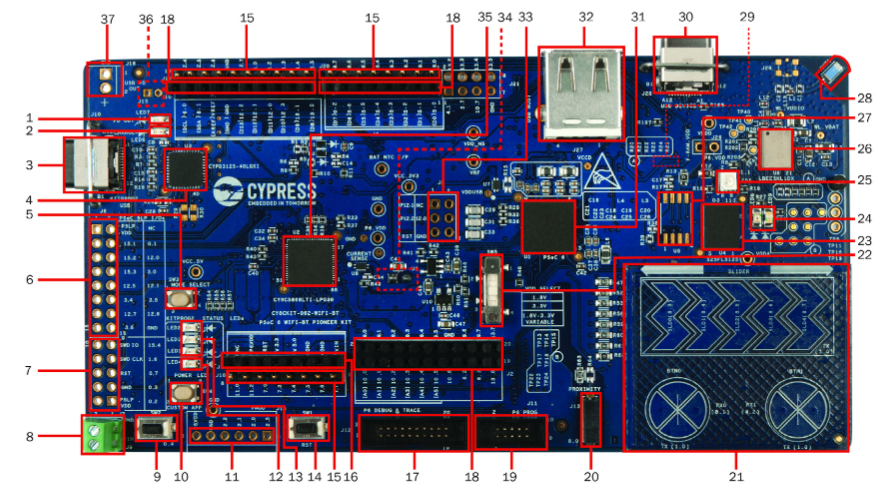

.. _cy8ckit-062-wifi-bt:

PSoC6 WiFi-BT Pioneer Kit
#########################

Overview
********

The PSoC 6 WiFi-BT Pioneer Kit (CY8CKIT-062-WiFi-BT) is a low-cost hardware
platform that enables design and debug of the PSoC 62 MCU and the Murata
LBEE5KL1DX Module (CYW4343W WiFi + Bluetooth Combo Chip).
The PSoC 6 WiFi-BT Pioneer Kit features the PSoC 62 MCU: a single- or
dual-core MCU, with an Arm Cortex-M4 and Arm Cortex-M0+, 1MB of Flash, 288KB
of SRAM, 104 GPIO, 7 programmable analog blocks, 56 programmable digital
blocks, Full-Speed USB, a serial memory interface, a PDM-PCM digital
microphone interface, and industry-leading capacitive-sensing with CapSense.

1. USB PD output voltage availability indicator (LED7)
2. Battery charging indicator (LED6)
3. KitProg2 USB Type-C connector (J10)
4. Cypress EZ-PD™ CCG3 Type-C Port Controller with PD (CYPD3125-40LQXI, U3)
5. KitProg2 programming mode selection button (SW3)
6. KitProg2 I/O header (J6)1
7. KitProg2 programming/custom application header (J7)1
8. External power supply connector (J9)
9. PSoC 6 user button (SW2)
10. KitProg2 application selection button (SW4)
11. Digilent® Pmod™ compatible I/O header (J14)1
12. Power LED (LED4)
13. KitProg2 status LEDs (LED1, LED2, and LED3)
14. PSoC 6 reset button (SW1)
15. PSoC 6 I/O header (J18, J19 and J20)
16. Arduino™ Uno R3 compatible power header (J1)
17. PSoC 6 debug and trace header (J12)
18. Arduino Uno R3 compatible PSoC 6 I/O header (J2, J3 and J4)
19. PSoC 6 program and debug header (J11)
20. CapSense proximity header (J13)
21. CapSense slider and buttons
22. PSoC 6 VDD selection switch (SW5)
23. Cypress  512-Mbit  serial  NOR  Flash  memory  (S25-FL512S, U4)
24. PSoC 6 user LEDs (LED8 and LED9)
25. RGB LED (LED5)
26. WiFi/BT module (LBEE5KL 1DX, U6)
27. Cypress serial Ferroelectric RAM (U5)1
28. WiFi-BT Antenna
29. VBACKUP and PMIC control selection switch (SW7)2
30. PSoC 6 USB device Type-C connector (J28)
31. Cypress PSoC 6 (CY8C6247BZI-D54, U1)
32. PSoC 6 USB Host Type-A connector (J27)
33. Arduino Uno R3 compatible ICSP header (J5)1
34. PSoC 6 power monitoring jumper (J8)2
35. KitProg2  (PSoC  5LP)  programmer  and  debugger(CY8C5868LTI-LP039, U2)
36. Battery connector (J15)1,2
37. USB PD output voltage (9V/12V) connector (J16)

Hardware
********
Supported Features
==================

The board configuration supports the following hardware features:

+-----------+------------+----------------------+
| Interface | Controller | Driver/Component     |
+===========+============+======================+
| NVIC      | on-chip    | nested vectored      |
|           |            | interrupt controller |
+-----------+------------+----------------------+
| SYSTICK   | on-chip    | system clock         |
+-----------+------------+----------------------+
| UART      | on-chip    | serial port          |
+-----------+------------+----------------------+
| GPIO      | on-chip    | gpio                 |
+-----------+------------+----------------------+

The default configuration can be found in the Kconfig
:file:`boards/arm/cy8ckit_062_wifi_bt_m4/cy8ckit_062_wifi_bt_m4_defconfig`.

Interrupt Controller
====================

TBD

System Clock
============

TBD

Serial Port
===========

TBD

Programming and Debugging
*************************

Flashing
========

TBD

References
**********

You can order the PSoC6 + WiFi kits and download documentation here:
http://www.cypress.com/documentation/development-kitsboards/psoc-6-wifi-bt-pioneer-kit

